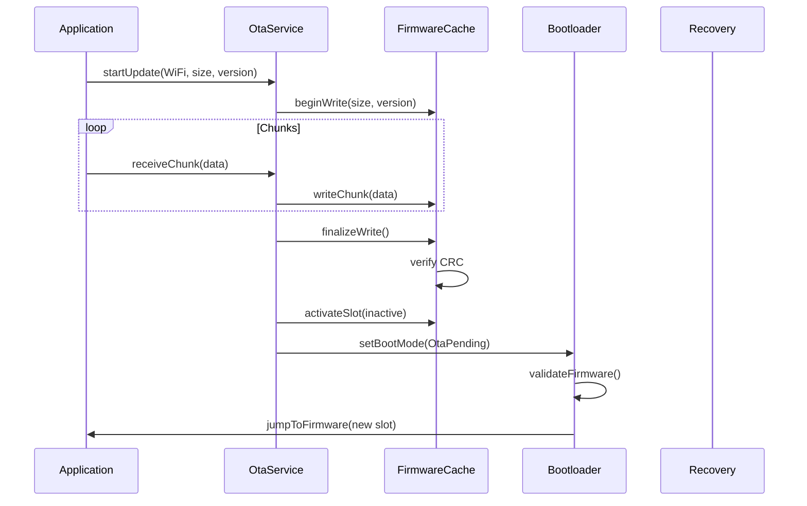
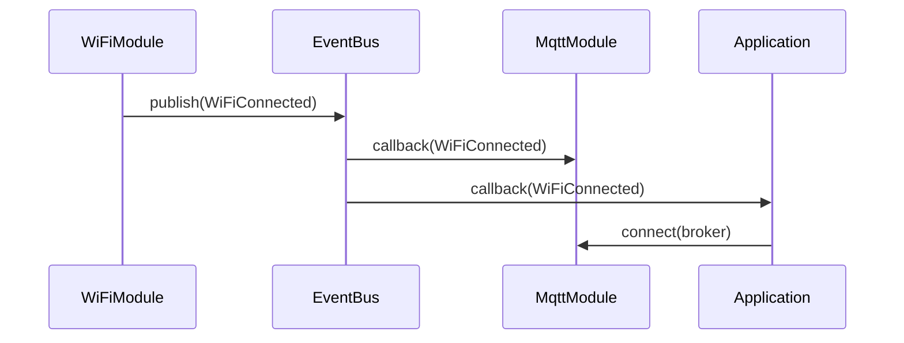
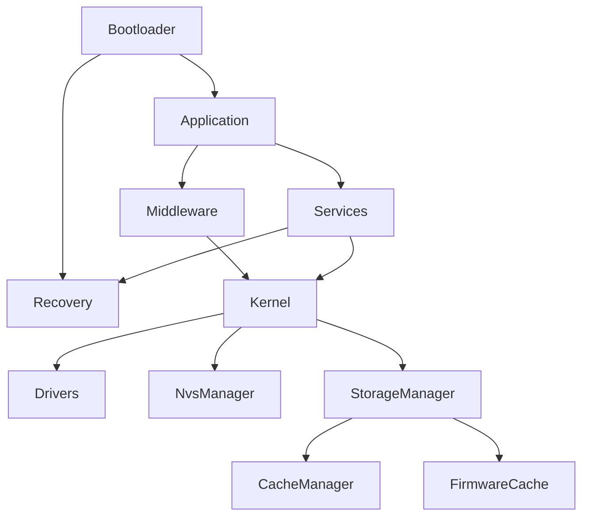

# TAKT OS Architecture

## 1. Обзор

TAKT OS — операционная система реального времени для ESP32, построенная на концепции **такта** (нем. Takt — такт, цикл). В отличие от FreeRTOS и аналогов, где планирование основано на приоритетах задач, TAKT OS использует **детерминированный циклический диспетчер**: каждый такт ядро последовательно вызывает все зарегистрированные модули.

### Ключевые принципы

1. **Детерминизм** — каждый модуль получает управление в фиксированном порядке каждый такт
2. **Предсказуемость** — статические модули выполняют строго ограниченный объём работы
3. **Модульность** — все подсистемы реализованы как модули с единым интерфейсом `IModule`
4. **Отказоустойчивость** — независимый bootloader и recovery layer
5. **Промышленная готовность** — профилирование, диагностика, OTA с откатом

## 2. Уровни архитектуры

```
┌─────────────────────────────────────────────────────────┐
│                   Application Layer                      │
│  UART │ Modbus │ MQTT │ BLE │ WiFi │ WebServer │ Wash  │
├─────────────────────────────────────────────────────────┤
│                   Middleware Layer                       │
│  Modules (Static / Dynamic / Background)                 │
├─────────────────────────────────────────────────────────┤
│                   Services Layer                         │
│  OTA Service │ Telemetry │ Config Manager               │
├─────────────────────────────────────────────────────────┤
│                   Kernel Layer                           │
│  Scheduler │ EventBus │ TimerManager │ Diagnostics      │
│  StorageManager │ CacheManager │ FirmwareCache │ NVS    │
├─────────────────────────────────────────────────────────┤
│                   Drivers Layer                          │
│  GPIO │ UART │ ADC │ SPI │ I2C │ Platform               │
├─────────────────────────────────────────────────────────┤
│                   Recovery Layer                         │
│  BLE DFU │ WiFi OTA │ Rollback │ Firmware Install       │
├─────────────────────────────────────────────────────────┤
│                   Bootloader                             │
│  Boot Mode │ Validation │ Emergency │ Partition Jump     │
├─────────────────────────────────────────────────────────┤
│                   Hardware (ESP32)                       │
└─────────────────────────────────────────────────────────┘
```

## 3. Концепция такта

```
  Takt N                          Takt N+1
  ┌──────────────────────────┐   ┌──────────────────────────┐
  │ Timer Tick               │   │ Timer Tick               │
  │ Event Dispatch           │   │ Event Dispatch           │
  │ ┌──────┐ ┌──────┐       │   │ ┌──────┐ ┌──────┐       │
  │ │ UART │→│Sensor│→ ...  │   │ │ UART │→│Sensor│→ ...  │
  │ └──────┘ └──────┘       │   │ └──────┘ └──────┘       │
  │ ┌──────┐ ┌──────┐       │   │ ┌──────┐                │
  │ │ WiFi │ │ MQTT │       │   │ │ WiFi │  (bg, idle)    │
  │ └──────┘ └──────┘       │   │ └──────┘                │
  │ Statistics / Overrun     │   │ Statistics / Overrun     │
  └──────────────────────────┘   └──────────────────────────┘
```

### Типы модулей

| Тип | Поведение в такте | Контроль времени |
|-----|-------------------|-------------------|
| Static | Всегда вызывается, фиксированный объём | `budgetUs()` — лимит мкс |
| Dynamic | Всегда вызывается, объём определяет модуль | Нет жёсткого лимита |
| Background | Вызывается только при `hasWork() == true` | Пропускается при idle |

## 4. Карта памяти Flash

```
Offset      Size      Partition
0x001000    28 KB     Bootloader (ESP-IDF 2nd stage)
0x009000     4 KB     Partition Table
0x010000   256 KB     Recovery Firmware
0x050000  1536 KB     App Slot A (OTA_0)
0x1D0000  1536 KB     App Slot B (OTA_1)
0x350000    64 KB     NVS
0x360000   640 KB     Raw Storage
```

## 5. Потоки данных

### OTA Update Flow



### Event Bus Flow



## 6. Зависимости компонентов



## 7. Сравнение с классическими RTOS

| Аспект | FreeRTOS | TAKT OS |
|--------|----------|---------|
| Планирование | Приоритеты + preemptive | Циклический такт |
| Детерминизм | Зависит от приоритетов | Гарантирован порядок |
| Накладные расходы | Context switch ~1-5 мкс | Прямой вызов, 0 switch |
| Сложность | Высокая (deadlock, priority inversion) | Низкая (линейный цикл) |
| Параллелизм | Многозадачность | Кооперативный в рамках такта |
| Подходит для | Общего назначения | Промышленные контроллеры, IoT-шлюзы |

## 8. Целевые устройства

- **WASH-PRO** — контроллеры автомоек самообслуживания
- **IoT-шлюзы** — агрегация телеметрии Modbus/MQTT
- **Промышленные контроллеры** — управление оборудованием
- **Телеметрия** — сбор и передача данных с датчиков
