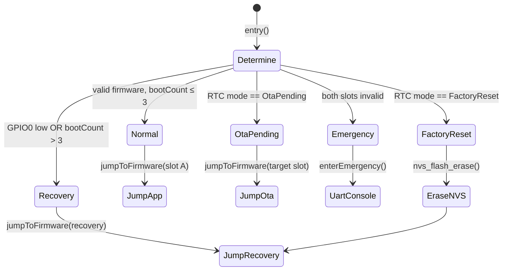
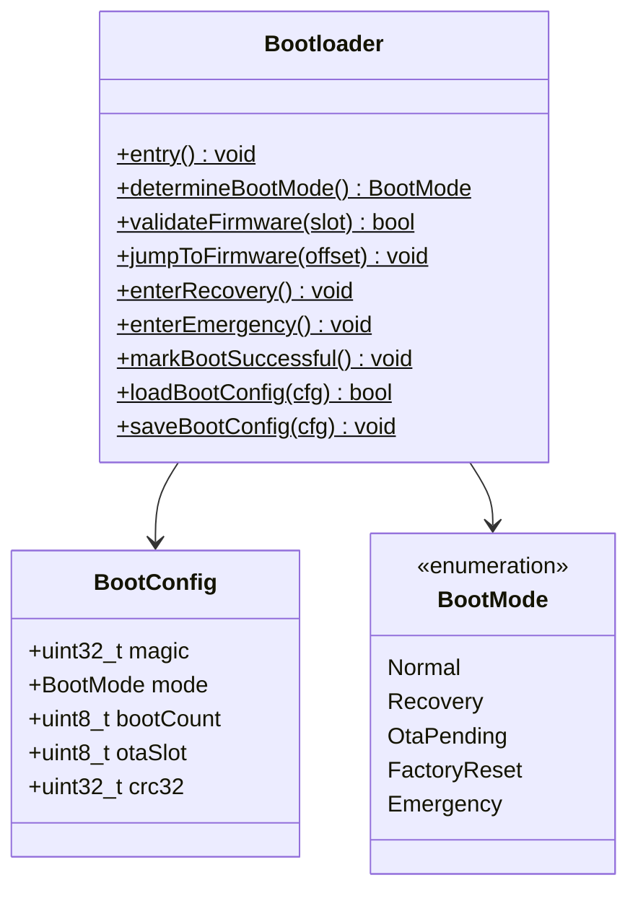

# TAKT OS Bootloader

## Назначение

Bootloader — минимальная прошивка, работающая **независимо** от основного приложения. Запускается ESP-IDF second-stage bootloader и отвечает за выбор режима загрузки, валидацию прошивки и переход в нужный раздел.

## Функции

| Функция | Описание |
|---------|----------|
| Запуск системы | Определение boot mode, переход к прошивке |
| Выбор режима загрузки | GPIO, RTC memory, boot counter |
| Проверка валидности | Magic, CRC32, size проверка FirmwareHeader |
| OTA Recovery | Активация нового слота после OTA |
| BLE Recovery | Переход в recovery partition |
| Аварийное восстановление | UART console при полной порче прошивки |

## Режимы загрузки



## BootConfig (RTC Memory)

Структура сохраняется в `RTC_NOINIT_ATTR` — переживает soft reset, но не power cycle:

```cpp
struct BootConfig {
    uint32_t magic;       // 0xB007C0DE
    BootMode mode;        // Normal / Recovery / OtaPending / ...
    uint8_t  bootCount;   // Инкремент при каждой загрузке
    uint8_t  otaSlot;     // Целевой слот OTA
    uint32_t crc32;       // CRC структуры
};
```

### Логика bootCount

1. При каждой загрузке `bootCount++`
2. Если `bootCount > 3` — принудительный переход в Recovery (защита от boot loop)
3. При успешном старте приложения вызывается `Bootloader::markBootSuccessful()` → `bootCount = 0`

## GPIO Boot Pin

| Pin | Состояние | Действие |
|-----|-----------|----------|
| GPIO0 | LOW при reset | Recovery mode |
| GPIO0 | HIGH | Normal boot |

## Валидация прошивки

```
validateFirmware(slot):
  1. Read FirmwareHeader from slot offset
  2. Check magic == 0x54414B54 ('TAKT')
  3. Check flags & VALID
  4. Check size ≤ slot size
  5. Compute CRC32 of image body
  6. Compare with header.crc32
```

## API

```cpp
#include "takt/bootloader.hpp"

// В app_main после успешного старта:
takt::boot::Bootloader::markBootSuccessful();

// Принудительный переход в recovery:
BootConfig cfg{};
Bootloader::loadBootConfig(cfg);
cfg.mode = BootMode::Recovery;
Bootloader::saveBootConfig(cfg);
esp_restart();
```

## Независимость от основной прошивки

Bootloader располагается в отдельном разделе flash (`0x001000`, 28 KB). Даже при полном повреждении App Slot A и B:

1. `bootCount` превысит порог → Recovery
2. Если Recovery валиден → DFU доступен
3. Если Recovery повреждён → Emergency UART console

## UML


