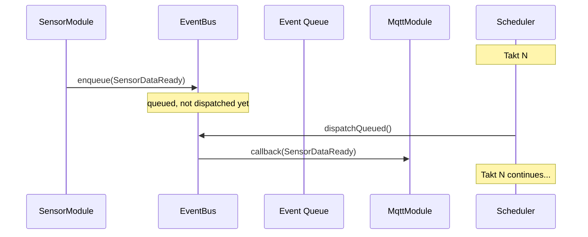
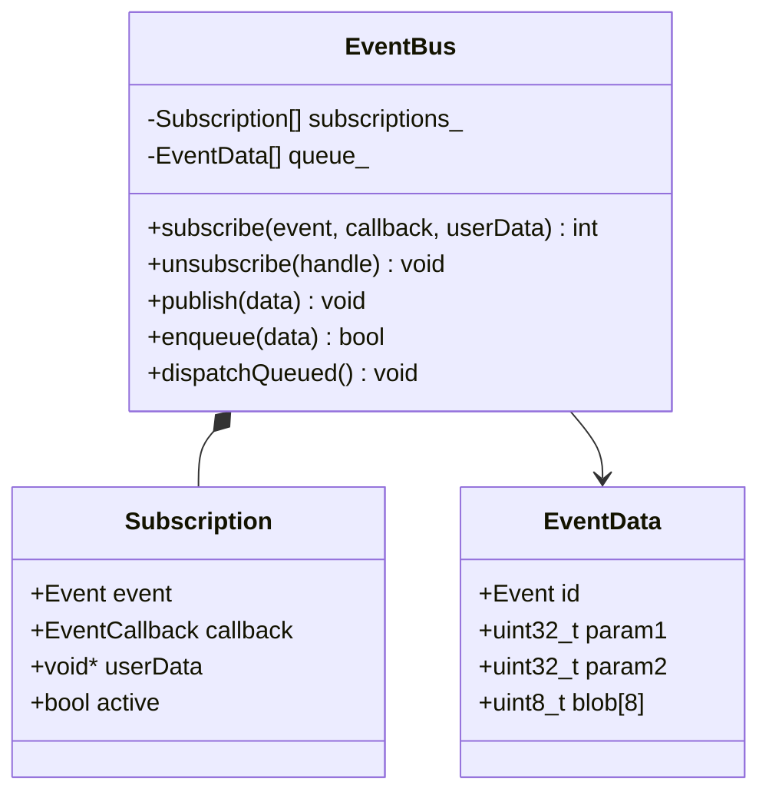

# TAKT OS Event Bus

## Назначение

Event Bus — шина событий типа publish/subscribe для слабосвязанного взаимодействия между модулями. Модули не вызывают друг друга напрямую, а публикуют события.

## API

### Подписка

```cpp
// C-style callback
int handle = takt::EventBus::instance().subscribe(
    takt::Event::WiFiConnected,
    [](const takt::EventData& data, void* ctx) {
        auto* mqtt = static_cast<takt::modules::MqttModule*>(ctx);
        mqtt->connect("broker.example.com");
    },
    &mqttModule
);

// Макрос
TAKT_SUBSCRIBE(takt::Event::SensorDataReady, onSensorData, nullptr);
```

### Публикация

```cpp
// Немедленная (синхронная) доставка
takt::EventBus::instance().publish(takt::Event::WiFiConnected);

// С параметрами
takt::EventBus::instance().publish(takt::Event::OtaProgress, bytesReceived, totalBytes);

// Отложенная (в конце такта)
takt::EventData data{};
data.id = takt::Event::SensorDataReady;
data.param1 = temperature_x100;
takt::EventBus::instance().enqueue(data);
```

### Отписка

```cpp
takt::EventBus::instance().unsubscribe(handle);
```

## Каталог событий

| Диапазон | Категория | Примеры |
|----------|-----------|---------|
| 0x0001–0x00FF | System | SystemBoot, TaktOverrun, MemoryLow |
| 0x0100–0x01FF | Connectivity | WiFiConnected, MqttConnected |
| 0x0200–0x02FF | OTA/Recovery | OtaStart, OtaComplete, OtaRollback |
| 0x0300–0x03FF | Application | SensorDataReady, WashCycleStart |
| 0x1000+ | User-defined | Кастомные события приложения |

## EventData

```cpp
struct EventData {
    Event    id;       // Идентификатор события
    uint32_t param1;   // Первый параметр
    uint32_t param2;   // Второй параметр
    uint8_t  blob[8];  // Inline payload (до 8 байт)
};
```

## Доставка



1. **Синхронная** (`publish`) — немедленный вызов всех подписчиков
2. **Асинхронная** (`enqueue` + `dispatchQueued`) — доставка на границе такта

Рекомендация: внутри `tick()` использовать `enqueue()`, не `publish()` — это предотвращает каскадные вызовы внутри одного модуля.

## Ограничения

| Параметр | Значение |
|----------|----------|
| Max subscribers | 32 |
| Queue depth | 64 |
| Callback type | C function pointer (no heap allocation) |

## UML


