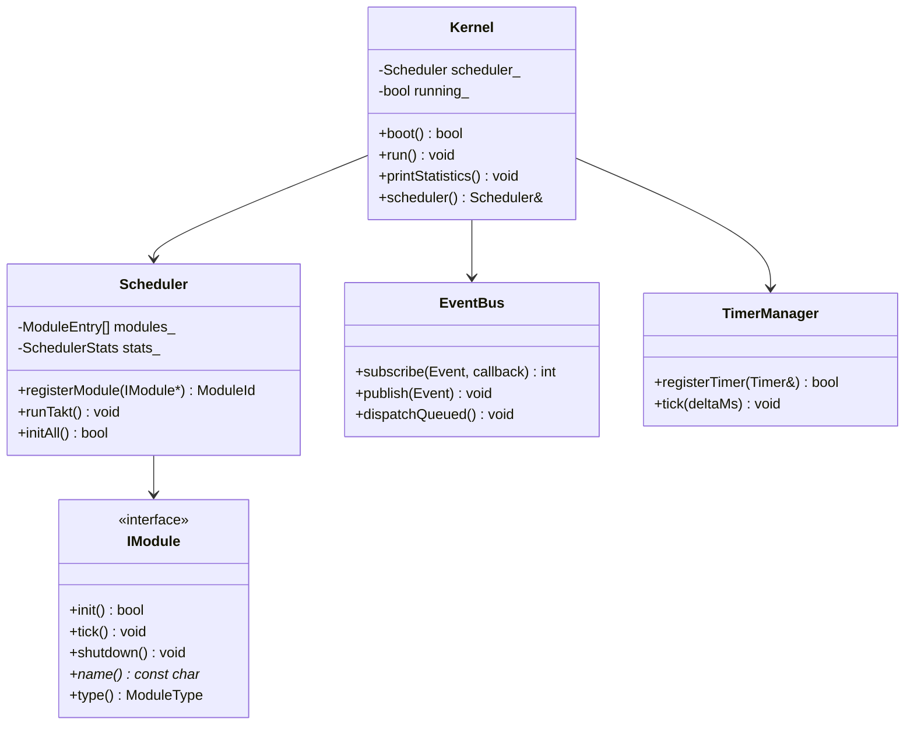

# TAKT OS Kernel

## Обзор

Ядро TAKT OS — центральный оркестратор системы. Владеет планировщиком тактов, шиной событий, менеджером таймеров и подсистемами памяти. Не зависит от ESP-IDF FreeRTOS task API для выполнения прикладной логики — вся работа происходит в едином потоке тактов.

## Компоненты ядра

| Компонент | Файл | Назначение |
|-----------|------|------------|
| `Kernel` | `kernel.hpp` | Точка входа, lifecycle, диагностика |
| `Scheduler` | `scheduler.hpp` | Цикл тактов, регистрация модулей |
| `EventBus` | `event_bus.hpp` | Pub/Sub шина событий |
| `TimerManager` | `timer_manager.hpp` | Программные таймеры |
| `Logger` | `logger.hpp` | Уровневое логирование |
| `Diagnostics` | `diagnostics.hpp` | Профилирование, heap, stack |
| `StorageManager` | `storage_manager.hpp` | Прямой доступ к Flash |
| `CacheManager` | `cache_manager.hpp` | LRU-кэш поверх Flash |
| `FirmwareCache` | `firmware_cache.hpp` | Dual-bank OTA |
| `NvsManager` | `nvs_manager.hpp` | Key-value хранилище |

## Жизненный цикл

```mermaid
stateDiagram-v2
    [*] --> Boot: Power On
    Boot --> InitNVS: boot()
    InitNVS --> InitModules: NvsManager::init()
    InitModules --> Ready: scheduler.initAll()
    Ready --> Running: run()
    Running --> Running: runTakt()
    Running --> Shutdown: requestShutdown()
    Shutdown --> [*]: shutdownAll()
```

## API

### Инициализация

```cpp
auto& kernel = takt::Kernel::instance();
auto& scheduler = kernel.scheduler();

scheduler.registerModule(&uartModule);
scheduler.registerModule(&sensorModule);

scheduler.setTaktPeriodMs(1);      // 1 мс между тактами
scheduler.setTaktBudgetUs(5000);   // 5 мс максимум на такт

kernel.boot();  // init NVS, init modules, publish SystemReady
kernel.run();   // бесконечный цикл тактов
```

### Диагностика

```cpp
kernel.printStatistics();
// Output:
// === TAKT OS Statistics ===
// Uptime: 30000 ms
// Takts: 30000, max: 1200 us, overruns: 0
// Heap free: 180000, min: 175000, largest block: 110000
// Modules: 6
//   [0] ticks=30000 last=45 us max=120 us overruns=0 skips=0
//   ...
```

## Модель выполнения

Ядро работает в контексте ESP-IDF `app_main()` (или host `main()`). Между тактами на ESP32 вызывается `vTaskDelay()` для отдачи CPU задаче IDLE — это единственная точка взаимодействия с FreeRTOS.

```
app_main()
  └─ Kernel::boot()
       ├─ NvsManager::init()
       ├─ EventBus::publish(SystemBoot)
       └─ Scheduler::initAll()
            └─ IModule::init() × N
  └─ Kernel::run()
       └─ Scheduler::run()
            └─ loop:
                 ├─ TimerManager::tick(deltaMs)
                 ├─ EventBus::dispatchQueued()
                 ├─ IModule::tick() × N  (последовательно)
                 └─ overrun detection
```

## Конфигурация

| Параметр | По умолчанию | Описание |
|----------|-------------|----------|
| `kMaxModules` | 48 | Макс. зарегистрированных модулей |
| `kMaxTimers` | 32 | Макс. активных таймеров |
| `kMaxEventSubscribers` | 32 | Макс. подписчиков на EventBus |
| `kEventQueueDepth` | 64 | Глубина очереди отложенных событий |
| `TAKT_LOG_LEVEL` | Debug | Уровень логирования |

## UML Class Diagram


