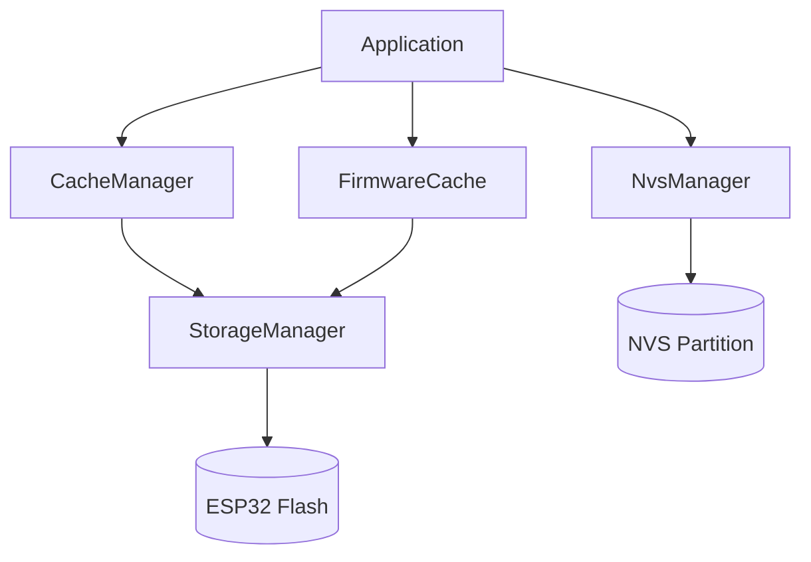
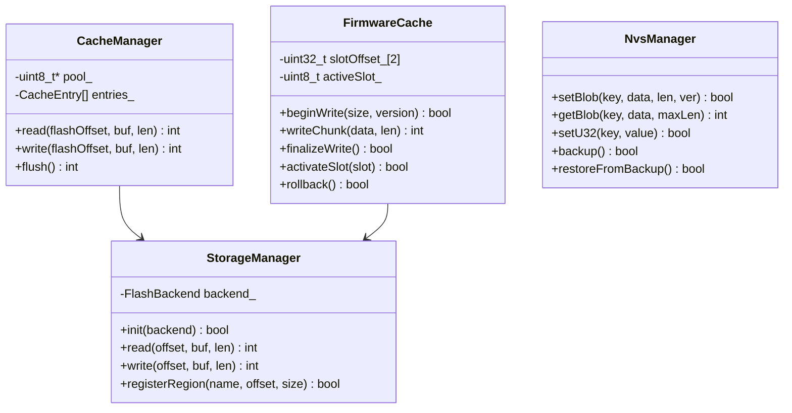

# TAKT OS Memory Management

## Философия

TAKT OS **не использует** SPIFFS/LittleFS по умолчанию. Свободная Flash-память используется как произвольное байтовое хранилище через `StorageManager`. Файловые системы подключаются только если того требует конкретное приложение.

## Компоненты



## StorageManager

Прямой доступ к flash-памяти через абстракцию `FlashBackend`.

### FlashBackend

```cpp
struct FlashBackend {
    std::function<int(uint32_t offset, void* buf, size_t len)> read;
    std::function<int(uint32_t offset, const void* buf, size_t len)> write;
    std::function<int(uint32_t offset, size_t len)> erase;
    uint32_t totalSize;
    uint32_t sectorSize;  // 4096 для ESP32
};
```

### Именованные регионы

```cpp
auto& storage = takt::StorageManager::instance();
storage.init(flashBackend);

storage.registerRegion("telemetry", 0x360000, 256 * 1024);
storage.registerRegion("config",    0x3A0000, 64 * 1024);
storage.registerRegion("logs",      0x3B0000, 128 * 1024);

// Чтение/запись:
uint8_t buf[64];
storage.read(0x360000, buf, sizeof(buf));
storage.write(0x360000, buf, sizeof(buf));  // auto erase-before-write
```

### Карта регионов (по умолчанию)

| Регион | Offset | Size | Назначение |
|--------|--------|------|------------|
| `ota_a` | 0x050000 | 1536 KB | App Slot A |
| `ota_b` | 0x1D0000 | 1536 KB | App Slot B |
| `nvs` | 0x350000 | 64 KB | NVS key-value |
| `storage` | 0x360000 | 640 KB | Произвольные данные |

## CacheManager

LRU-кэш поверх flash для снижения wear и ускорения доступа.

```cpp
uint8_t cachePool[16 * 1024];
takt::CacheManager cache(cachePool, sizeof(cachePool), 256);

cache.write(0x360000, data, len);   // write to cache (dirty)
cache.read(0x360000, buf, len);       // read through cache
cache.flush();                         // write-back dirty lines
```

| Параметр | Значение |
|----------|----------|
| Max lines | 64 |
| Eviction | LRU |
| Policy | Write-back |
| Line size | Configurable (power of 2) |

## FirmwareCache

Dual-bank OTA с атомарным переключением.

### FirmwareHeader

```cpp
struct FirmwareHeader {
    uint32_t magic;      // 0x54414B54 ('TAKT')
    uint32_t version;    // 0xMMmmpp
    uint32_t size;
    uint32_t crc32;
    uint32_t timestamp;
    uint8_t  slot;       // 0=A, 1=B
    uint8_t  flags;      // bit0=valid, bit1=bootable, bit2=pending_verify
};
```

### OTA Flow

```cpp
auto& fc = takt::FirmwareCache::instance();
fc.init(0x050000, 0x1D0000, 0x180000);

fc.beginWrite(imageSize, 0x00010000);
fc.writeChunk(data, len);  // repeat
fc.finalizeWrite();         // CRC + mark valid
fc.activateSlot(fc.inactiveSlot());
```

## NvsManager

Key-value хранилище с защитой от повреждений.

### Возможности

- Типизированные значения: blob, u8, u16, u32, string
- Версионирование каждого ключа
- CRC32 на каждую запись
- Резервное копирование (backup sector)
- Восстановление из backup при corruption

### API

```cpp
auto& nvs = takt::NvsManager::instance();
nvs.init("takt");

nvs.setString("wifi_ssid", "MyNetwork", /*version=*/1);
nvs.setU32("boot_count", 0, 2);

char ssid[64];
nvs.getString("wifi_ssid", ssid, sizeof(ssid));

uint32_t count;
nvs.getU32("boot_count", count);

nvs.verifyIntegrity();
nvs.backup();
```

### Защита от повреждений

```
writeEntry(key, data, len, version):
  1. Compute CRC32 of data
  2. Write NvsEntry metadata (key, version, size, crc32)
  3. Write data blob
  4. Commit to NVS

readEntry(key, data, maxLen):
  1. Read NvsEntry metadata
  2. Read data blob
  3. Verify CRC32
  4. If CRC mismatch → attempt restoreFromBackup()
```

## UML


