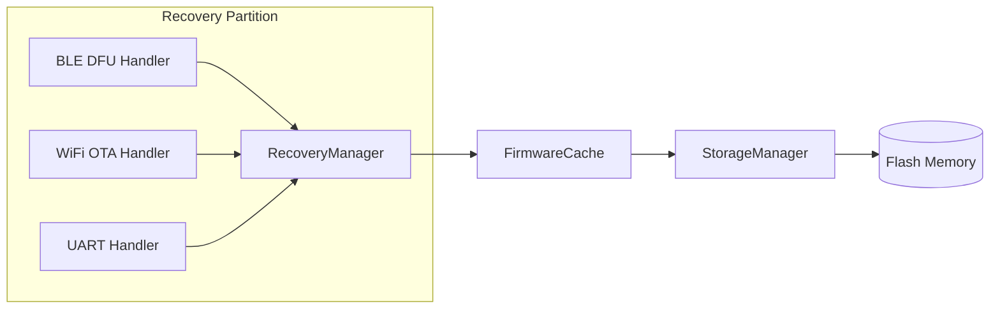
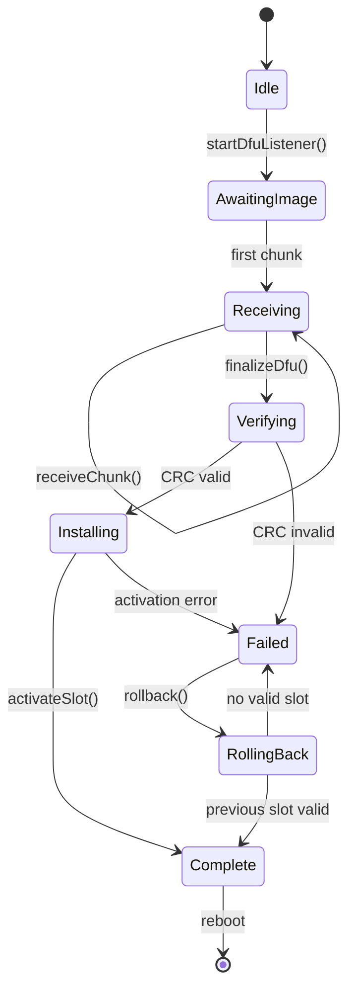

# TAKT OS Recovery Layer

## Назначение

Recovery — автономный модуль восстановления, расположенный в отдельном flash-разделе (256 KB). Запускается bootloader'ом при невалидной основной прошивке или по запросу пользователя. Обеспечивает обновление и откат прошивки даже при полном повреждении application layer.

## Функции

| Функция | Канал | Описание |
|---------|-------|----------|
| BLE DFU | Bluetooth LE | Приём прошивки через GATT |
| OTA DFU | WiFi | HTTP/MQTT firmware download |
| Загрузка прошивки | UART | Fallback для производства |
| Откат | Internal | Активация предыдущего слота |

## Архитектура



## DFU State Machine



## API

```cpp
#include "takt/recovery_manager.hpp"

auto& recovery = takt::recovery::RecoveryManager::instance();

recovery.init(takt::recovery::RecoveryChannel::Ble);
recovery.onProgress([](uint32_t rx, uint32_t total, auto state) {
    printf("DFU: %u/%u state=%u\n", rx, total, static_cast<uint8_t>(state));
});

recovery.startDfuListener();
// ... chunks arrive via BLE/WiFi/UART ...
recovery.finalizeDfu();  // verify + install + reboot
```

## Откат прошивки

Dual-bank архитектура (Slot A / Slot B):

1. Активный слот — текущая прошивка
2. Неактивный слот — принимает OTA
3. После успешной записи и верификации — `activateSlot(inactive)`
4. При сбое новой прошивки (bootCount > 3) — bootloader запускает Recovery
5. `rollback()` — атомарная активация предыдущего слота

```cpp
// Откат из приложения:
takt::recovery::RecoveryManager::instance().rollback();
// или через OTA Service:
takt::services::OtaService::rollback();
```

## Независимость

Recovery partition:
- Собственный `CMakeLists.txt` / ESP-IDF component
- Минимальные зависимости: `takt_kernel` (StorageManager, FirmwareCache, Logger)
- Не зависит от middleware (WiFi, MQTT, BLE modules)
- BLE/WiFi стеки инициализируются внутри recovery при необходимости

## Безопасность

- CRC32 верификация перед активацией
- Запись только в неактивный слот
- Атомарное переключение слота (обновление flags в FirmwareHeader)
- bootCount watchdog предотвращает boot loop на битой прошивке
