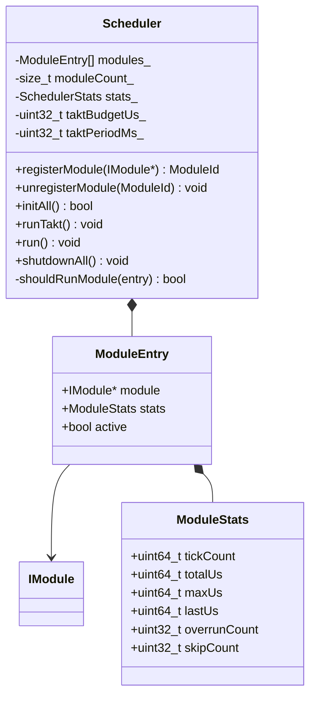

# TAKT OS Scheduler

## Концепция

Scheduler — сердце TAKT OS. Каждый вызов `runTakt()` — один такт: последовательный обход всех зарегистрированных модулей с измерением времени и детекцией overrun.

## Алгоритм такта

```
runTakt():
  1. taktStart = nowUs()
  2. TimerManager::tick(taktPeriodMs)
  3. EventBus::dispatchQueued()
  4. for each registered module (in order):
       a. if !shouldRunModule(): skip, increment skipCount
       b. modStart = nowUs()
       c. module->tick()
       d. modElapsed = nowUs() - modStart
       e. update ModuleStats (tickCount, lastUs, maxUs, totalUs)
       f. if modElapsed > budgetUs(): increment overrunCount, log warning
  5. taktElapsed = nowUs() - taktStart
  6. update SchedulerStats
  7. if taktElapsed > taktBudgetUs: publish TaktOverrun event
```

## Политика диспетчеризации

| ModuleType | Условие вызова | При idle |
|------------|----------------|----------|
| `Static` | Всегда | tick() вызывается |
| `Dynamic` | Всегда | tick() вызывается |
| `Background` | `hasWork() == true` | Пропуск, skipCount++ |

## Регистрация модулей

```cpp
takt::Scheduler scheduler;

takt::modules::UartModule   uart(0, 16);
takt::modules::SensorModule sensor;
takt::modules::WiFiModule   wifi;

auto uartId = scheduler.registerModule(&uart);    // ModuleId = 0
auto sensId = scheduler.registerModule(&sensor);  // ModuleId = 1
auto wifiId = scheduler.registerModule(&wifi);    // ModuleId = 2

scheduler.initAll();  // вызов init() для каждого модуля
```

Порядок регистрации = порядок вызова в такте. Для промышленных систем рекомендуется:

1. Критичные по времени (Sensor, GPIO) — первыми
2. Коммуникационные (UART, Modbus) — в середине
3. Сетевые (WiFi, MQTT, BLE) — в конце
4. Фоновые (OTA, File) — последними

## Статистика

### SchedulerStats

| Поле | Тип | Описание |
|------|-----|----------|
| `totalTakts` | uint64 | Общее число тактов |
| `totalTaktUs` | uint64 | Суммарное время всех тактов |
| `maxTaktUs` | uint64 | Максимальная длительность такта |
| `lastTaktUs` | uint64 | Длительность последнего такта |
| `overrunCount` | uint32 | Число превышений taktBudgetUs |
| `registeredModules` | uint32 | Число модулей |

### ModuleStats

| Поле | Тип | Описание |
|------|-----|----------|
| `tickCount` | uint64 | Сколько раз вызван tick() |
| `totalUs` | uint64 | Суммарное время |
| `maxUs` | uint64 | Максимальное время одного tick() |
| `lastUs` | uint64 | Время последнего tick() |
| `overrunCount` | uint32 | Превышения budgetUs() |
| `skipCount` | uint32 | Пропуски (background idle) |

## Конфигурация бюджета

```cpp
scheduler.setTaktPeriodMs(1);       // Период такта: 1 мс
scheduler.setTaktBudgetUs(5000);    // Бюджет: 5 мс (для demo controller)

// Per-module budget (статические модули):
class UartModule : public IModule {
    uint32_t budgetUs() const override { return 500; }  // 500 мкс
};
```

## UML



## Рекомендации

1. **Период такта 1 мс** — оптимален для demo controller и IoT-шлюзов
2. **taktBudgetUs ≤ 80% периода** — оставлять запас для FreeRTOS IDLE
3. **Статические модули** — всегда задавать `budgetUs()`
4. **Динамические модули** — ограничивать работу внутри tick(), не блокировать
5. **Фоновые модули** — корректно реализовать `hasWork()`
